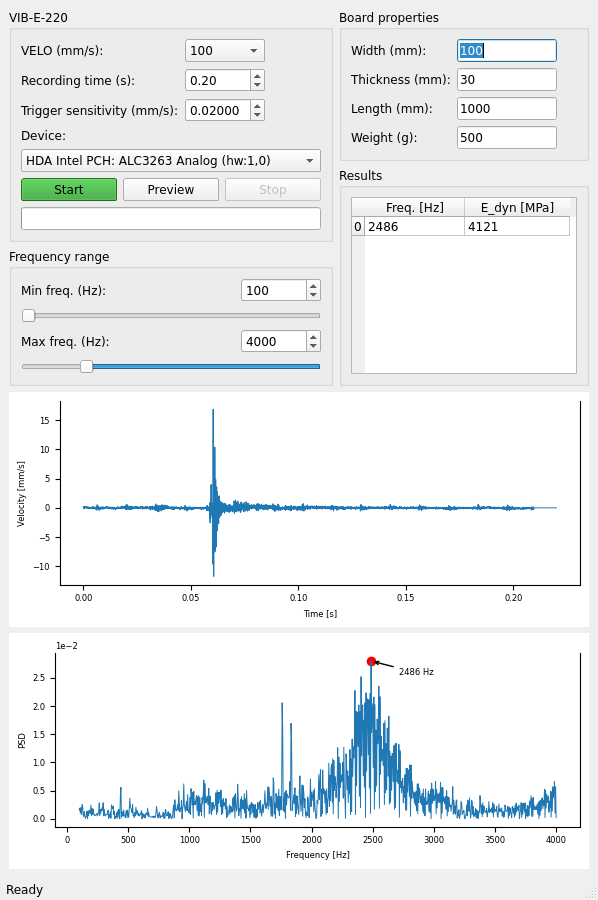

#  Vibrometer analysis 

A program to analyze the signal comming from a laser vibrometer and obtain the eigenfrequencies.
However, it is very general and can be used with other signal sources (any microphone basically).

## Highlights

* Live preview of the input signal
* Autotrigger FFT when an impulse is detected
* Chose from different input sources (microphones)
* Compute dynamic modulus of elasticity based on the obtained frequency, given the dimensions of the board and weight
* Works on Linux and Windows (and probably MaxOS, but I havn't tested that)

That's it! Pretty cool, right?
