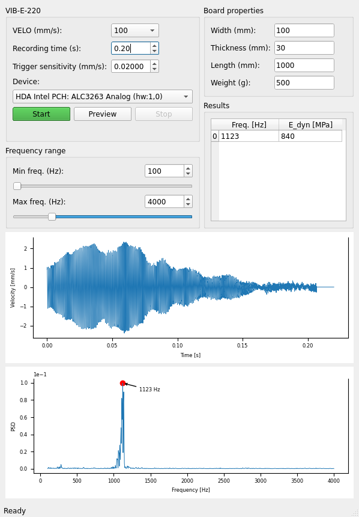

#  Vibrometer analysis 

A Qt-program to compute dynamic modulus of elasticity of boards, by analyzing an input signal and computing the corresponding eigenfrequencies.
It was developed specifically to work with the VIB-E-220 data acquisition device (Polytec) together with a laser vibrometer, however, it is very general and can be used with other signal sources (any microphone basically).



## Highlights

* Live preview of the input signal
* Autotrigger FFT when an impulse is detected
* Chose from different input sources (microphones)
* Compute dynamic modulus of elasticity based on the obtained frequency, given the dimensions of the board and weight
* Works on Linux and Windows (and probably MaxOS, but I haven't tested that)

That's it! Pretty cool, right?

## Installation

Use poetry:

```
git clone https://github.tik.uni-stuttgart.de/MPA-Holzkonstruktionen/vibrometer_analysis.git
cd vibrometer_analysis
poetry install
```
